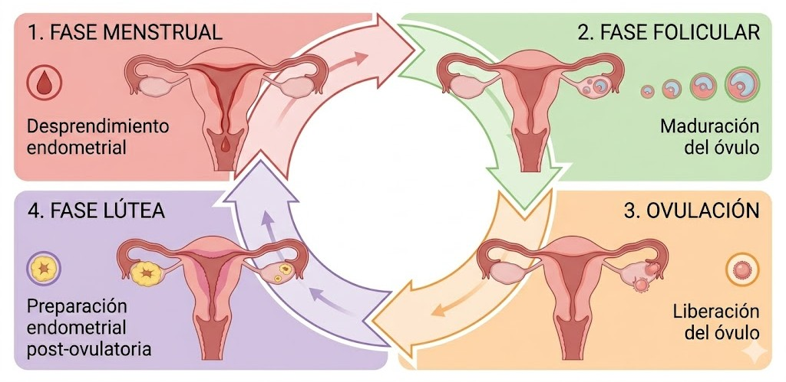

# Ciclo menstrual: Clasificación de las fases mediante Deep Learning

::: {style="font-size: 0.6em; color: #2D2926; margin-bottom: 30px; letter-spacing: 2px; text-align: center;"}
MODELOS DE DEEP LEARNING
:::

::::: columns
::: {.column width="50%" style="text-align: center;"}
**Integrantes:** <br> Sofía Roca Contreras <br> Bianca Bruna Ramírez
:::

::: {.column width="50%" style="text-align: center;"}
**Profesor:** <br> Francisco Plaza-Vega
:::
:::::

::: {style="margin-top: 40px; font-size: 0.55em; color: #9B4D4D; text-align: center;"}
Universidad de Santiago de Chile
:::

# Introducción

## ¿Qué es el ciclo menstrual? {.smaller}

El ciclo menstrual [@msd2024ciclomenstrual] es un proceso biológico continuo que se define anatómica y endocrinológicamente a través de una secuencia cíclica de 4 fases:

:::: {.columns}

::: {.column width="60%"}
{#fig-etiqueta fig-align="center"}
:::

::: {.column width="40%"}
- **Fase menstrual:** Es la etapa inicial, donde ocurre el desprendimiento y expulsión del tejido endometrial. Hay una baja en los niveles de estrógeno y progesterona.

- **Fase folicular:** Los niveles de estrógeno aumentan lo que impulsa la reconstrucción del revestimiento uterino y la maduración de lo folículos ováricos.

- **Ovulación:** Se alcanza el punto máximo en los niveles de estrógeno y existe aumento repentino de la hormona luteinizante (LH) lo que desencadena la liberación del óvulo.

- **Fase lútea:** Después de la ovulación, el foliculo vacio se transforma en cuerpo lúteo, secretando progresterona para densificar el endometrio.
:::

::::

## Ciclos regulares e irregulares {.smaller}

**Ciclo regular**: La duración habitual es de 24 a 38 días y la variación entre el ciclo más corto y el más largo de la misma persona es menor a 7 - 9 días.

**Ciclo irregular**: Es cuando se cumple una de esas condiciones:

- Es más corto de 24 días (Polimenorrea).

- Es más largo de 38 días (Oligomenorrea).

- La variación entre el ciclo más largo y el más corto es mayor a 9 días en un periodo de 6 meses.

Variación ciclo = Ciclo más largo - Ciclo más corto [@munro2022figo]

# Planteamiento del problema

## Planteamiento del problema {.smaller}

**Problema:** Los métodos manuales y calendarios asumen ciclos estáticos y regulares. Estos fallan ante alteraciones por estrés, estilo de vida o diagnósticos médicos; además, son propensos al error humano.

También tenemos un desafío computacional, ya que los historiales menstruales conforman series temporales ruidosas, incompletas y con dependencias complejas a largo plazo.

Por lo que los algoritmos lineales clásicos son incapaces de procesar y capturar esta variabilidad de manera efectiva.

**Solución:** Desarrollar arquitecturas avanzadas de Deep Learning que procesen secuencias temporales y biomarcadores fisiológicos para clasificar las fases en ciclos regulares e irregulares.

## Justificación {.smaller}

Algunas de las dimensiones que más se ven impactadas al desarrollar un buen modelo de clasificación son:

- **Salud Reproductiva y Planificación Familiar:** Permite a las parejas planificar o evitar embarazos de manera natural, reduciendo los riesgos de salud o económicos.

- **Manejo Personalizado de Síntomas:** Ayuda a gestionar ciertos síntomas como la fatiga, cambios de humor, calambres, etc.

- **Intervenciones Nutricionales y de Estilo de Vida:** La clasificación de la fase habilita la creación de recomendaciones dietéticas personalizadas, ya que los requerimientos nutricionales varían según la etapa del ciclo.

- **Cierre de la Brecha Tecnológica y Educativa:** Implementar soluciones basadas en IA no solo provee predicciones clínicas, sino que ofrece a las mujeres un espacio confidencial y educativo para gestionar su salud de manera proactiva.

# Estado del Arte 

## Modelado de Series Temporales {.smaller}

::: {style="font-size: 70%;"}
| Modelo | Precisión | Adaptabilidad |
|------------------|------------------|------------------|
| **LSTM** [@khairunisa2025comparison] | **90% – 91.3%** | Excelente. Modela ciclos irregulares. |
| **CNN 1D** | **88.9%** | Buena: Identifica patrones clave, pero es inferior a LSTM en secuencias largas. |
| **ML Clásico** [@harshavardhan2025ai] | **78% – 85.2%** | Baja. Falla ante ciclos irregulares. |
:::

\vspace{0.3cm}

\scriptsize Por lo tanto, las redes **LSTM** dominan la clasificación de las fases del ciclo menstrual, debido a su capacidad para capturar dependencias temporales y patrones históricos complejos. En cambio, el modelo clásico presenta dificultades para mantener la consistencia temporal en ciclos irregulares.

## Biomarcadores Fisiológicos {.smaller}

::: {style="font-size: 70%;"}
| Biomarcador | Modelo Aplicado | Objetivo Clínico | Resultado |
|------------------|------------------|------------------|------------------|
| **Temperatura Corporal Basal (BBT)** | Red LSTM | Identificar la ventana de ovulación. | \~95% de precisión minimizando el Error Absoluto Medio (MAE). |
| **Temperatura Piel Abdominal (AST)** [@murayama2023determination] | LSTM Bidireccional + CPD(Cumulative Probability Distribution). | Clasificar con éxito las fases: folicular, ovulatoria y lútea | Mejora notable en la detección de fases complejas, elevando significativamente el *F-measure.* |
:::

\scriptsize El uso de biometría continua mediante sensores portátiles ha permitido identificar fases del ciclo menstrual con una precisión cercana al nivel clínico.

## Arquitecturas de Vanguardia {.smaller}

::: {style="font-size: 70%;"}
| Enfoque | Algoritmos | Aplicación | Impacto |
|------------------|------------------|------------------|------------------|
| **Nutrición** [@logapriya2024optimized] | Transformers | Identificar fases a partir de síntomas y recomendar dietas personalizadas. | **96% precisión** al procesar datos de síntomas para recomendaciones nutricionales |
| **Prevención de Riesgos** [@gulati2026menstrual] | Ecosistemas Multimodelo (Random Forest) | Evalúa síntomas para alertar sobre condiciones (como el SOP o dismenorrea) y pronostica síntomas diarios. | 73% de exactitud en síntomas de alerta y 82% al pronosticar síntomas. |
| **Sistemas híbridos** [@khadse2025systematic] | Reglas Matemáticas + LSTM | Corregir ciclos anómalos con biometría. | Menor MSE y alta precisión temporal. |
:::

\vspace{0.15cm}

\scriptsize En general, la tendencia actual es combinar múltiples modelos de inteligencia artificial para construir sistemas más precisos, personalizados y adaptativos.

# Hipótesis y objetivos

## Hipótesis {.smaller}

**Hipótesis principal**:  Contrario a métodos tradicionales (como el método del calendario o regresión lineal) que asumen ciclos menstruales regulares, un modelo de Deep Learning enfocado en secuencias temporales (como LSTM y 1D-CNN) logrará clasificar de manera precisa en que fase se encuentra una persona, adaptándose a usuarias con ciclos irregulares.

**Hipótesis secundarias**:

- Los modelos de Deep Learning, como el modelo de clasificación *many-to-one*, superarán a los algoritmos tradicionales de Machine Learning en la clasificación de las tres clases (Menstrual/Folicular, Ovulatoria y Lútea), mostrando un desempeño superior al ser evaluados bajo métricas para clasificación.

- El aplicar técnicas de imputación de datos mitigará el impacto negativo de los registros nulos en historiales clínicos incompletos, preservando la varianza biológica original de las usuarias y previniendo la alteración de las dependencias a largo plazo necesarias para el entrenamiento de la red LSTM.

## Objetivos {.smaller}

**Objetivo general:** Desarrollar, implementar y evaluar un sistema de clasificación basado en arquitecturas de Deep Learning secuenciales, capaz de determinar con alta precisión la fase del ciclo menstrual de una usuaria, modelando las dependencias temporales y la variabilidad presente en ciclos irregulares.

**Objetivos específicos:**

- Ejecutar un código de preprocesamiento para datos secuenciales que incluya la limpieza e imputación, la normalización de escalas numéricas y la codificación *One-Hot* de las variables objetivo, transformando la base de datos tabular en estructura de tensores 3D mediante ventanas temporales.

- Construir modelos de redes neuronales (1D-CNN y LSTM) estructurados bajo una arquitectura *Many-to-One* con una capa de salida *Softmax* de 3 clases, aplicando técnicas para evitar el sobreajuste en los datos irregulares.

- Comparar el rendimiento predictivo de las arquitecturas propuestas frente a modelos de referencia clásicos de Machine Learning, validando la capacidad de clasificación mediante el análisis de la matriz de confusión y otras métricas tales como la sensibilidad, la exactitud y el F1-Score. 

# Metodología preliminar

# Base de datos {.smaller}

**Base de datos** de 80 variables y 1.665 observaciones extraída de [Kaggle](https://www.kaggle.com/datasets/nikitabisht/menstrual-cycle-data)

Registros de ciclos menstruales de 159 personas.

::: {style="font-size: 52%;"}
| Variables | Descripción | Tipo |
|:------------------:|:------------------:|:------------------:|
| id | Identificador único de la usuaria | Texto |
| numero_ciclo | Número secuencial del ciclo registrado para esa usuaria | Entero |
| edad | Edad de la usuaria | Entero |
| imc | Índice de Masa Corporal (IMC) | Decimal |
| duracion_ciclo | Duración total del ciclo en días. | Entero |
| promedio_duracion_ciclo | Promedio de duración de los ciclos de la usuaria | Entero |
| duracion_menstruacion | Duración del periodo menstrual (días de sangrado) | Entero |
| promedio_duracion_menstruacion | Promedio de duración de la menstruación | Decimal |
| intensidad_sangrado_media | Intensidad promedio de sangrado | Decimal |
| primer_dia_alta_fertilidad | Primer día de niveles "altos" de fertilidad detectados | Entero |
| total_dias_alta_fertilidad | Cantidad total de días con fertilidad alta | Entero |
| total_dias_peak_fertilidad | Cantidad de días en el nivel máximo (Peak) de fertilidad | Entero |
| dia_estimado_ovulacion | Día estimado de la ovulación dentro del ciclo | Entero |
| duracion_fase_lutea | Duración de la fase lútea (post-ovulación) | Entero |
:::

## Visualización {.smaller}

Visualización de las primeras 5 observaciones de la base de datos.

::: {style="font-size: 45%; overflow-x: auto;"}
| id | numero_ciclo | edad | imc | duracion_ciclo | promedio_duracion_ciclo | duracion_menstruacion | promedio_duracion_menstruacion | intensidad_sangrado_media | primer_dia_alta_fertilidad | total_dias_alta_fertilidad | total_dias_peak_fertilidad | dia_estimado_ovulacion | duracion_fase_lutea |
|---|:---:|:---:|:---:|:---:|:---:|:---:|:---:|:---:|:---:|:---:|:---:|:---:|:---:|
| nfp8122 | 1 | 36 | 21.25472 | 29 | 27.33 | 5 | 4.49 | 9.04 | 12 | 5 | 2 | 17 | 12 |
| nfp8122 | 2 | NA | NA | 27 | NA | 5 | NA | NA | 13 | 2 | 2 | 15 | 12 |
| nfp8122 | 3 | NA | NA | 29 | NA | 5 | NA | NA | NA | 1 | 2 | 15 | 14 |
| nfp8122 | 4 | NA | NA | 27 | NA | 5 | NA | NA | 13 | 2 | 2 | 15 | 12 |
| nfp8122 | 5 | NA | NA | 28 | NA | 5 | NA | NA | 12 | 4 | 2 | 16 | 12 |
:::

```{r}
#| label: setup-datos
#| message: false
#| warning: false

library(dplyr)

setwd("C:/Users/sofir/OneDrive/Escritorio/Universidad/Deep learning/Código")
datos_ciclos = read.csv("FedCycleData071012 (2).csv")

datos_ciclos = datos_ciclos %>%
  # Variables de entrada (Features / X):
  # Variables biométricas (Estáticas): Age, BMI
  # Variables históricas (Base de referencia del paciente): MeanCycleLength, MeanMensesLength, 
  # MeanBleedingIntensity
  # Variables dinámicas secuenciales (El corto plazo temporal): LengthofCycle, LengthofMenses, 
  # FirstDayofHigh,
  # TotalNumberofHighDays, TotalNumberofPeakDays
  
  # Variables de salida (Target / Y):
  # EstimatedDayofOvulation,
  # LengthofLutealPhase
  select(ClientID, CycleNumber, Age, BMI, LengthofCycle, MeanCycleLength, LengthofMenses,
         MeanMensesLength, MeanBleedingIntensity, FirstDayofHigh, TotalNumberofHighDays,
         TotalNumberofPeakDays, EstimatedDayofOvulation, LengthofLutealPhase)

# Dado que las observaciones fijas (como la edad o el imc) aparecen solo una vez para cada
# persona, se necesita utilizar la funcion fill para rellenar hacia abajo.

datos_ciclos = datos_ciclos %>% 
  rename(id                         = ClientID,
         numero_ciclo               = CycleNumber,
         edad                       = Age,
         imc                        = BMI,
         duracion_ciclo             = LengthofCycle,
         promedio_duracion_ciclo    = MeanCycleLength,
         duracion_menstruacion      = LengthofMenses,
         promedio_duracion_menstruacion   = MeanMensesLength,
         intensidad_sangrado_media  = MeanBleedingIntensity,
         primer_dia_alta_fertilidad            = FirstDayofHigh,
         total_dias_alta_fertilidad           = TotalNumberofHighDays,
         total_dias_peak_fertilidad            = TotalNumberofPeakDays,
         dia_estimado_ovulacion     = EstimatedDayofOvulation,
         duracion_fase_lutea        = LengthofLutealPhase)
```

```{r}
#| label: grafico-interactivo
#| message: false
#| warning: false

library(ggplot2)
library(dplyr)
library(plotly)
library(crosstalk)

# A. Limpieza defensiva
# Forzamos la estructura a data.frame puro, quitamos grupos previos de dplyr, 
# y evitamos cualquier NA en las columnas clave que pueda quebrar el menú.
df_plot <- datos_ciclos %>%
  ungroup() %>%
  select(id, numero_ciclo, duracion_ciclo) %>%
  filter(!is.na(id), !is.na(numero_ciclo), !is.na(duracion_ciclo)) %>%
  mutate(id = as.character(id)) %>%
  as.data.frame()

# B. Crear el objeto SharedData
# Pasamos la llave como un vector directo (df_plot$id) en lugar de una fórmula (~id)
sd_data <- SharedData$new(df_plot, key = df_plot$id)

# C. Crear el menú desplegable (Dropdown)
filtro <- filter_select(
  id = "filtro_id", 
  label = "Selecciona el ID de la usuaria:", 
  sharedData = sd_data, 
  group = ~id, 
  multiple = FALSE
)

# D. Crear el gráfico base con ggplot2
# El argumento 'group = id' sigue siendo vital para que las líneas se tracen por usuaria
grafico_base <- ggplot(sd_data, aes(x = numero_ciclo, y = duracion_ciclo, group = id)) +
  geom_line(color = "#9B4D4D", linewidth = 1) +
  geom_point(color = "#9B4D4D", size = 1.5) +
  labs(
    title = "Fluctuación de la Duración del Ciclo Menstrual en el Tiempo",
    x = "Número de Ciclo (Secuencia temporal)",
    y = "Duración del Ciclo (Días)"
  ) +
  theme_minimal() +
  theme(
    plot.title = element_text(color = "#2D2926", size = 14),
    axis.title = element_text(color = "#2D2926"),
    panel.grid.minor = element_blank()
  )

# E. Unir el filtro y el gráfico en la estructura HTML
bscols(
  widths = c(12, 12),
  filtro,
  ggplotly(grafico_base, tooltip = c("x", "y"))
)
```


## Metodología {.smaller}

::::: {.columns}

:::: {.column width="47%"}

- **Fase 1**: Definición del problema.
   - Enfoque del problema.
   - Definir las clases (categorías).
   - Seleccionar las variables.

- **Fase 2**: Preprocesamiento de datos.
   - Limpieza e imputación de datos faltantes.
   - Normalización.
   - Codificación.
   - Estructura temporal.

- **Fase 3**: Arquitectura de modelos.
   - Modelos de referencia.
   - CNN 1D.
   - LSTM.
   - Capa de salida.
   
::::

:::: {.column width="6%"}
<!-- Columna invisible para separar -->
::::

:::: {.column width="47%"}


- **Fase 4**: Entrenamiento.
   - División de los datos.
   - Función de coste y optimización.
   - Prevención del sobreajuste.

- **Fase 5**: Métricas de evaluación.
   - Sensibilidad.
   - Exactitud.
   - Matriz de confusión.
   - F1-Score.

::::

:::::

# Conclusión

## Conclusiones y Próximos Pasos {.smaller}

- Tratar el ciclo menstrual como una serie temporal ruidosa justifica abandonar el Machine Learning clásico. La arquitectura propuesta (1D-CNN + LSTM Many-to-One) es ideal para extraer patrones locales y capturar la memoria a largo plazo en el caso de ciclos irregulares.

- La imputación secuencial (evitando eliminar los valores nulos) es un paso crítico para no romper con la cronología y preservar la varianza biológica de las usuarias.

- Al definir el problema estrictamente como una clasificación de 3 fases, la validación se centra en métricas robustas ante el desbalance, como el F1-Score y la matriz de confusión.

**Próximos pasos:** Desarrollar la imputación de datos, codificar los datos en tensores 3D mediante ventanas temporales, entrenar los modelos propuestos y validar empíricamente su rendimiento frente a modelos de Machine Learning.

## Referencias

<div style="font-size: 0.6em; line-height: 1.2;">
::: {#refs}
:::
</div>
